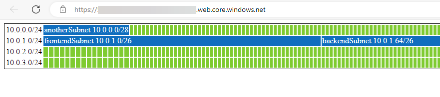

## Functions
### Get-AzSubnetVisualisationHTML
Produces HTML output of the IP space of a VNET showing available addresses and those assigned to subnets.


### Get-AzSubnetDetails
Used by Get-AzSubnetVisualisationHTML to create a detailed list of the subnets in a VNET.

## Deployment of Test Environment
The following can be run from a local or CloudShell PowerShell session, it will build a demonstration
VNET with subnets, create the visualisation, and upload it to a Static Website for viewing.

1. Create a Resource Group
2. Create an example VNET and subnets
3. Create a storage account (with unique name) and turn on Static Website hosting
4. Download function from Github
5. Run script against example VNET
6. Upload result to storage account.

```powershell
#Create a Resource Group
$RSG=New-AzResourceGroup -Name "test-subnet-visualisation-rsg" -Location centralus

#Create an example VNET and subnets
$frontendSubnet = New-AzVirtualNetworkSubnetConfig -Name frontendSubnet -AddressPrefix "10.0.0.0/28"
$backendSubnet  = New-AzVirtualNetworkSubnetConfig -Name backendSubnet  -AddressPrefix "10.0.1.64/26"
$anotherSubnet  = New-AzVirtualNetworkSubnetConfig -Name anotherSubnet  -AddressPrefix "10.0.4.0/26"
New-AzVirtualNetwork    -Name "test-subnet-visualisation-vnet" `
                        -ResourceGroupName $RSG.ResourceGroupName `
                        -Location centralus `
                        -AddressPrefix "10.0.0.0/22", "10.0.4.0/24" `
                        -Subnet $frontendSubnet,$backendSubnet,$anotherSubnet 

#Create a uniquely named storage account
$storageAccountName=((New-Guid).Guid -replace ("-","")).Substring(0,24)
while (!(Get-AzStorageAccountNameAvailability -Name $storageAccountName)){
    $storageAccountName=((New-Guid).Guid -replace ("-","")).Substring(0,24)
}
$storageAccount = New-AzStorageAccount  -ResourceGroupName $RSG.ResourceGroupName `
                                        -Name $storageAccountName `
                                        -Location centralus `
                                        -SkuName Standard_LRS `
                                        -Kind StorageV2
#Turn on Static Website hosting
$storageAccount.Context | Enable-AzStorageStaticWebsite -IndexDocument "index.html"

#Download function from Github
Invoke-WebRequest -Uri https://raw.githubusercontent.com/isjwuk/get-AzSubnetVisualisation/main/get-AzSubnetVisualisation.ps1 `
                    -OutFile get-AzSubnetVisualisation.ps1

#Run script against example VNET
. .\get-AzSubnetVisualisation.ps1
Get-AzSubnetVisualisationHTML -VnetName "test-subnet-visualisation-vnet" > index.html

#Upload result to storage account.
$Blob1HT = @{
  File             = '.\index.html'
  Container        = '$web'
  Blob             = "index.html"
  Context          = $storageAccount.Context
  StandardBlobTier = 'Hot'
  Properties = @{ ContentType = "text/html; charset=utf-8";}
}
Set-AzStorageBlobContent @Blob1HT
#Report back with the link to the output
"Visit "+$storageAccount.PrimaryEndpoints.Web+" to view details"
```

To tidy this up, just remove the Resource Group as follows. There is a very small cost to leaving this in place.
```powershell
Remove-AzResourceGroup -Name "test-subnet-visualisation-rsg"
```